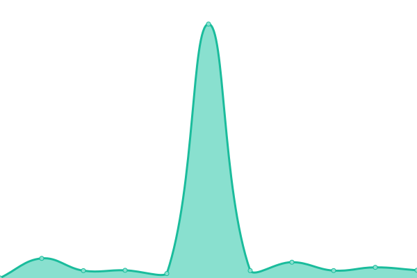
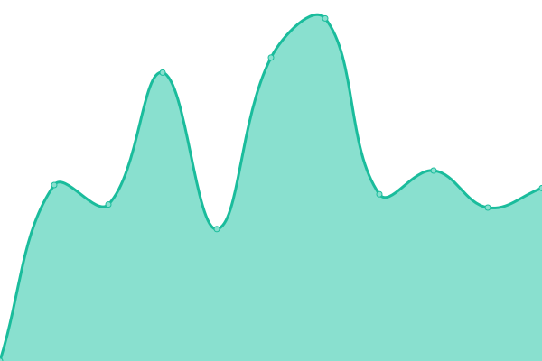

# [📈 Live Status](https://AnandChowdhary.github.io/status/): <!--live status--> **🟧 Partial outage**

This repository contains the open-source uptime monitor and status page for [Anand Chowdhary](https://anandchowdhary.com), powered by [Upptime](https://github.com/upptime/upptime).

With [Upptime](https://upptime.js.org), you can get your own unlimited and free uptime monitor and status page, powered entirely by a GitHub repository. We use [Issues](https://github.com/AnandChowdhary/status/issues) as incident reports, [Actions](https://github.com/AnandChowdhary/status/actions) as uptime monitors, and [Pages](https://AnandChowdhary.github.io/status/) for the status page.

<!--start: status pages-->
<!-- This summary is generated by Upptime (https://github.com/upptime/upptime) -->
<!-- Do not edit this manually, your changes will be overwritten -->

| URL                                              | Status  | History                                                                                                            | Response Time                                                                            | Uptime                                                                                                                                                                                                                                             |
| ------------------------------------------------ | ------- | ------------------------------------------------------------------------------------------------------------------ | ---------------------------------------------------------------------------------------- | -------------------------------------------------------------------------------------------------------------------------------------------------------------------------------------------------------------------------------------------------- |
| [AnandChowdhary.com](https://anandchowdhary.com) | 🟩 Up   | [anand-chowdhary-com.yml](https://github.com/AnandChowdhary/status/commits/master/history/anand-chowdhary-com.yml) |  749ms |  |
| [SukritiKapoor.com](https://sukritikapoor.com)   | 🟩 Up   | [sukriti-kapoor-com.yml](https://github.com/AnandChowdhary/status/commits/master/history/sukriti-kapoor-com.yml)   |  1287ms |    |
| [Test](https://testqwriwefi.com)                 | 🟥 Down | [test.yml](https://github.com/AnandChowdhary/status/commits/master/history/test.yml)                               |  0ms                  |                                 |

<!--end: status pages-->

[**Visit our status website →**](https://AnandChowdhary.github.io/status/)

## 📄 License

- Code: [MIT](./LICENSE) © [Anand Chowdhary](https://anandchowdhary.com)
- Data in the `./history` directory: [Open Database License](https://opendatacommons.org/licenses/odbl/1-0/)
